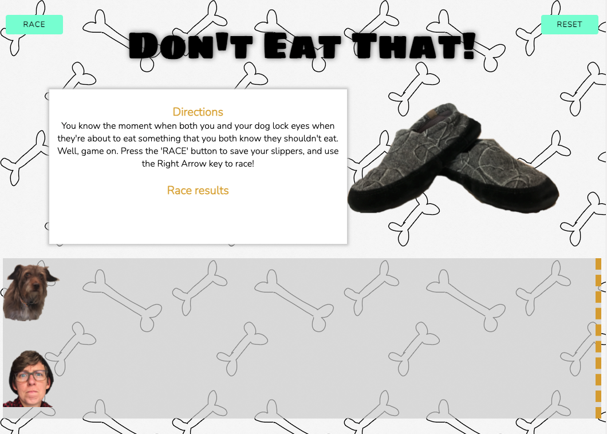

# GA Project 0

## This is Project #0: JavaScript Racer
This goal of this project is to utilize separation of logic to create a racing game between two opponents. Other requirements include utilizing flexbox, media queries, and adhering to style guides for JavaScript and HTML/CSS.

## User Stories
For my game, I chose to feature a human vs computer model that allows a human player to use an arrow key to control distance run in a race. The computer races the human at random intervals each time. A player can play multiple rounds by clicking a 'reset' button that resets the game board. In order to race, a player hits a "race" button which kicks off the computer player, and then can begin using arrow key right to control the player. At the end of the race, a message appear declaring the winner.

## Technologies Used 
I used **HTML** to create a title, **Race** and **Reset** buttons, a directions div layer that also hosts the "race results" message, a race course, and two images of each player. The theme is *Don't Eat That* which is a race between a human and dog. The two player images are of myself and my dog, and the picture of my slippers is a picture of *my actual slippers*. I used **CSS** to make the slippers rock back and forth on page load.

**CSS** was also used to style the page background with a repeating image I created on my iPad. I imported some fonts from **Google Fonts**, and styled the body and h1 with them. Using **flexbox**, I was able to create a responsive layout that shrinks and expands depending on screen size. I utilized a **media query** to change the font size and image size when a device is narrower than 950px.

Using **JavaScript**, I gave functionality the the Race and Reset buttons. There are **event listeners** attached to each button, and this controls game play. When a user hits the start button, it starts the **animation** of the Dog player. The dog travels from left to right of the screen at a random time interval determined using the **Math.random** function. Once the animation has finished running, a **function** is called to compare player positions with the **.offset()** method. If the dog "left" property is larger than the human "left" property, then doggo wins, and the inverse is also true.

To move the human player, I added a **'keydown' event listener** for the right arrow key. When the key is pressed, +30 pixels are added to a **variable** representing the "left" style property for the human player object.

Once a player hits the "reset" button, the "left" styling properties are set to 0 for both the human and dog player divs, as well as the positionRed variable which was the variable representing all incremented pixels added with the keydown function. Additionally, when "reset" is pressed, an event listener is added back to the start button that allows the game to begin again with a click.

## The Approach
To start my game, I relied on watching this youtube tutorial of a person using **jQuery** to create a racing game with two randomized computer players: *https://www.youtube.com/watch?v=QVSwX98kKFs*

I deviated from this tutorial in order to allow human interaction with one of the game pieces. I found this resource on creating vanilla javascript game controllers helpful: *https://www.w3schools.com/graphics/game_controllers.asp*

I struggled at first to solve the problem of reporting a winner of the game. At first, I relied on the original game's logic of getting to the end of an animation and then checking position, but then I took a different approach. After investigating code to detect object collision (*https://stackoverflow.com/questions/50378855/how-to-detect-if-two-divs-are-touching-collision-detection*) I returned to my original plan, and finally took the Game Project README's advice to explore jQuery's .offset() method. Ultimately, I used this method to reach MVP. I'd like to refactor this part of my code to be in Vanilla JavaScript, because most of the rest of my code is in Vanilla JavaScript.

## Installation
No installation needed.

## Unsolved Problems
~~Currently, the human player can keep incrimenting their style "left" properties infinitely. I'd like to figure out a way to keep the player from passing the finish line significantly. I might turn off the 'keydown' event listener at a certain event.~~ Fixed 08.11.21

## Wireframes
### Wireframe for Landing Page

### Wireframe for Game Play

